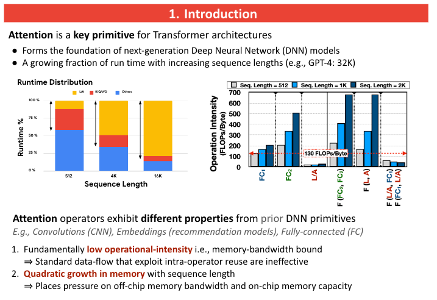
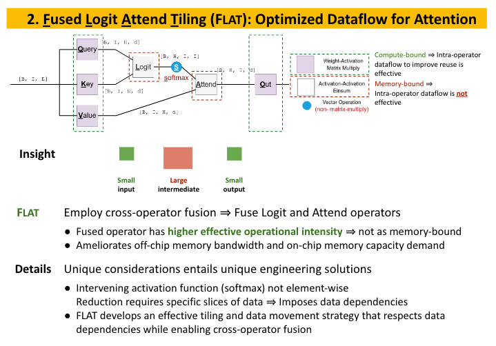
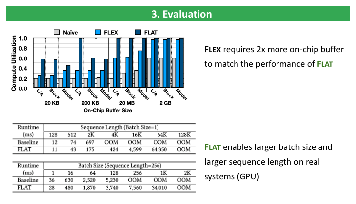
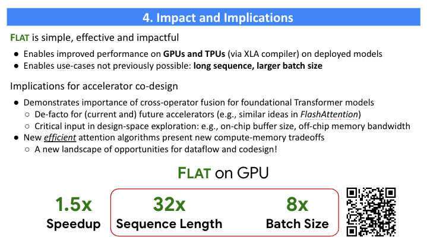

FLAT-Attention
===
*FLAT: An Optimized Dataflow for Mitigating Attention Bottlenecks*, [ASPLOS'23](https://arxiv.org/abs/2107.06419)

# Code Available
Coming soon

# Talks
ASPLOS'23, [slides](./doc/flat_poster.pdf), [poster](./doc/flat_poster.pdf), [video](https://www.youtube.com/watch?v=qhlUG1Knh6k&t=1s)

